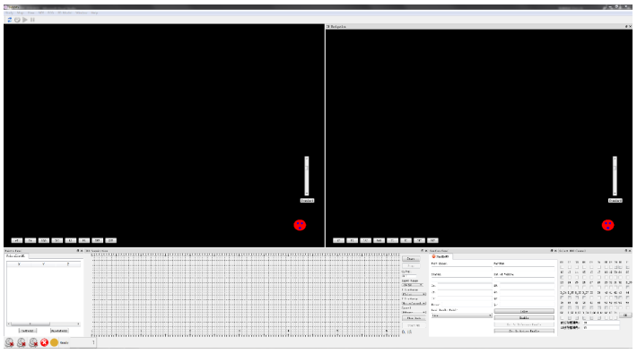
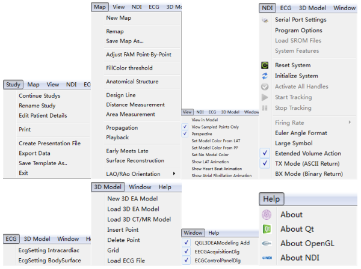

# 3DEMS
It is the implementation of three-dimensional electrophysiological mapping system.

## Installation:
The code was developed by Visual Studio 2012 and Qt5.2.1 on Windows 10.

## Requirements:
- OpenGL

## Contact:
cheng.wen.bts@gmail.com

## Mainwindow:

## Mainmenu:

## Subwindow:

